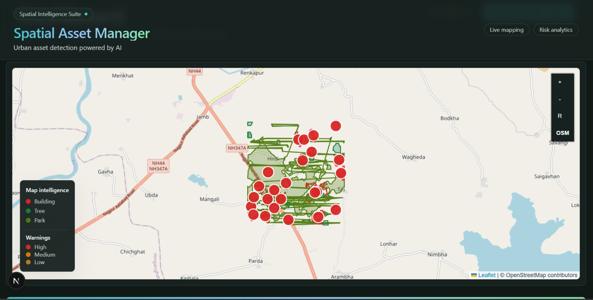
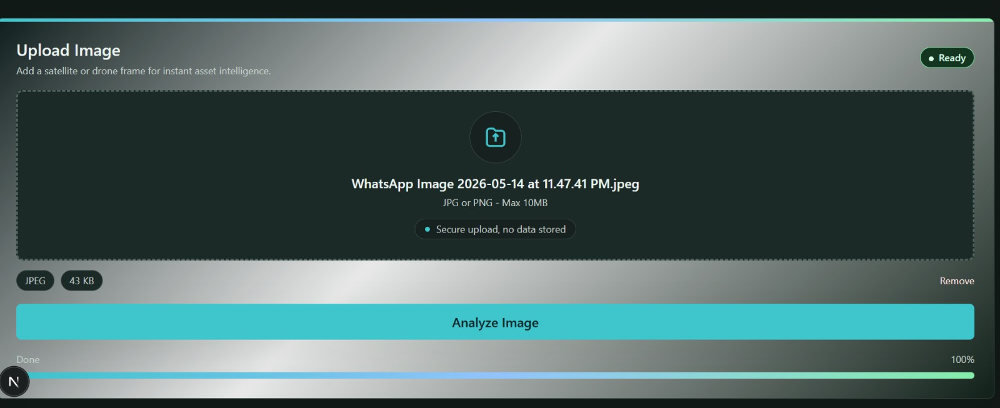
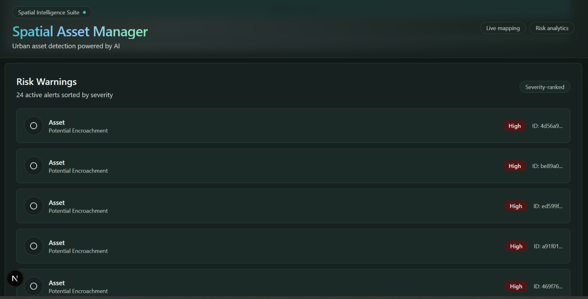
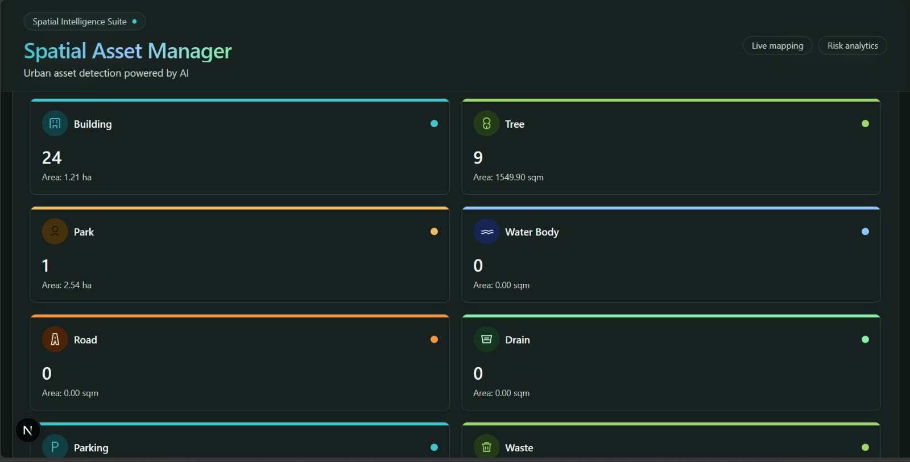

# 🛰️ AI-Powered Spatial Asset Management System


AI-powered detection and classification of urban and railway assets from satellite, drone, and aerial imagery.

Designed for smart-city governance and railway infrastructure intelligence, the platform combines AI-powered segmentation, geospatial visualization, and real-time risk analysis into a unified operational dashboard.

---

# What It Does

The system ingests drone or satellite imagery, detects assets such as buildings, trees, parks, water bodies, roads, drains, parking zones, waste areas, and solar panels using AI segmentation models, and visualizes them through an interactive GIS dashboard.

The backend processes imagery and returns:
- GeoJSON spatial polygons
- Asset summaries
- Risk warnings
- Detection metadata

The frontend then renders:
- Interactive Leaflet maps
- Severity-based warnings
- Spatial overlays
- Smart analytics cards
- Upload and export workflows

---

# Key Features

- AI-powered segmentation using YOLOv8
- Interactive GIS visualization with Leaflet
- Severity-ranked warning system
- Asset-wise statistics and analytics
- Modern dark-mode dashboard UI
- GeoJSON-ready spatial responses
- Railway infrastructure intelligence support
- Smart-city scalable architecture
- Image upload + analysis workflow
- Spatial overlays and map intelligence

---

# Tech Stack

| Layer | Technology |
|---|---|
| Frontend | Next.js, TypeScript, Tailwind CSS, Leaflet |
| Backend | FastAPI, Python, Pydantic |
| AI / Detection | YOLOv8 Segmentation |
| Spatial Processing | GeoPandas, Shapely |
| Spatial Database | PostGIS / Supabase-ready |
| Graph Intelligence | Neo4j |
| Optional LLM | Google Gemini |

---

# Repository Structure

```text
spatial-asset-system/
│
├── backend/        FastAPI backend services and APIs
├── frontend/       Next.js dashboard and map interface
├── docs/           Screenshots, architecture, and project notes
└── README.md
```

---

# API Contract

Frontend expects the following endpoints:

- `POST /api/v1/public/analyze`
- `POST /api/v1/public/chat`
- `GET /api/v1/official/assets`
- `GET /api/v1/official/warnings`
- `GET /api/v1/official/export?format=geojson`

---

# Sample Analyze Response

```json
{
  "image_id": "uuid",
  "summary": {
    "Building": {
      "count": 10,
      "total_area_sqm": 1200
    }
  },
  "geojson": {
    "type": "FeatureCollection",
    "features": []
  },
  "warnings": []
}
```

For accurate warning placement:
- `warning.asset_id`
must match:
- `feature.properties.asset_id`
or
- `feature.properties.id`

---

# Backend Setup

```bash
cd backend

python -m venv venv

venv\Scripts\activate

pip install -r requirements.txt

python -m uvicorn main:app --reload --host 0.0.0.0 --port 8000
```

### Backend URL

```text
http://localhost:8000
```

### Swagger API Docs

```text
http://localhost:8000/docs
```

---

# Frontend Setup

```bash
cd frontend

npm install --legacy-peer-deps

copy .env.example .env.local

npm run dev
```

### Frontend URL

```text
http://localhost:3000
```

### Dashboard URL

```text
http://localhost:3000/dashboard
```

---

# Frontend Environment Variables

```env
NEXT_PUBLIC_API_BASE_URL=http://localhost:8000/api/v1
```

---

# Demo Flow

1. Open `/dashboard`
2. Upload JPG or PNG imagery
3. Backend processes image using AI segmentation
4. Spatial polygons and warnings are generated
5. Frontend renders:
   - Asset polygons
   - Warning markers
   - Analytics cards
   - GIS overlays
6. Results can be exported as GeoJSON

---

#  Dashboard Preview

##  Interactive Spatial Map

Displays detected urban assets and live warning markers on an interactive GIS map.



---

##  Smart Upload Interface

Upload drone or satellite imagery for instant AI-powered analysis.



---

##  Risk Warning System

Severity-ranked alerts for potential encroachments and urban risks.



---

## Asset Summary Dashboard

Category-wise asset counts and area statistics generated from AI detections.



---

# System Vision

The platform is designed as a scalable geospatial intelligence layer for:
- Railway infrastructure monitoring
- Urban governance
- Smart-city operations
- Disaster surveillance
- Encroachment detection
- Environmental intelligence

---

#  Future Scope

-  Real-time drone video analysis
-  Live satellite feed integration
-  AI chat assistant for officials
-  Nationwide GIS intelligence deployment
-  Automated disaster-risk detection
-  Smart-city digital twin integration
-  Time-series urban change detection
-  Cloud-native scalable deployment

---

# Team

| Role | Responsibility |
|---|---|
| Frontend | Dashboard, Upload UI, GIS Visualization |
| Backend | FastAPI APIs and Spatial Services |
| AI/ML | YOLOv8 Detection Pipeline |
| Database | PostGIS and Neo4j Integration |

---

#  Notes

- Do not commit real secrets or credentials
- Keep backend contracts stable for frontend integration
- Use semantic theme tokens from `frontend/src/app/globals.css`
- GeoJSON responses should remain frontend-compatible

---

#  Built For Hackathon Innovation

A modern AI + GIS intelligence platform combining computer vision, spatial analytics, and operational dashboards for next-generation urban infrastructure management.